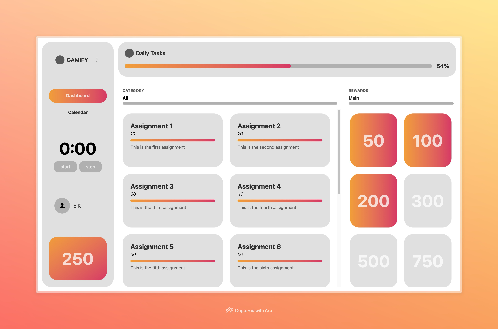

# Gamify

> A gamified productivity platform that transforms time management through AI-powered planning and reward systems.

## Overview

Gamify is an intelligent task management application that combines the functionality of a traditional calendar with AI-driven planning and a points-based reward system. By gamifying productivity, users stay motivated and engaged while efficiently managing their daily tasks and long-term goals.

## Core Features

### 📅 Intelligent Calendar Management

- **Daily Planning**: Input and organize daily calendar events with support for recurring tasks
- **AI-Powered Scheduling**: Automatic generation of optimized daily plans with intelligent time allocation
- **Smart Timeframes**: AI suggests optimal time slots for tasks based on priority and complexity

### 🎯 Gamification System

- **Points Allocation**: Earn points for completing tasks and meeting deadlines
- **Difficulty Scaling**: AI-powered task grading based on time investment and complexity
- **Reward System**: Unlock achievements and rewards using accumulated points

### 🔔 Smart Notifications

- **Deadline Alerts**: Proactive notifications for upcoming deadlines
- **Event Reminders**: Contextual reminders as events approach
- **Progress Tracking**: Real-time updates on daily and weekly progress

## Development Roadmap

### Phase 1: Core Functionality ✅

- [ ] Calendar integration and event management
- [ ] AI-powered daily plan generation
- [ ] Basic points allocation system
- [ ] Notification and reminder system

### Phase 2: Enhanced Gamification 🚧

- [ ] Advanced reward system implementation
- [ ] Achievement badges and milestones
- [ ] Progress analytics and insights
- [ ] Social features and leaderboards

## Technology Stack

- **Frontend**: React with TypeScript
- **Styling**: Tailwind CSS
- **Build Tool**: Vite
- **Development**: Node.js

## Contributors

Kenneth Lin (@klin2686)

Isaac Phoon (@IsaacPhoon)

Ethan Zhao (@dolphinalt)

## License

This project is licensed under the MIT License.
